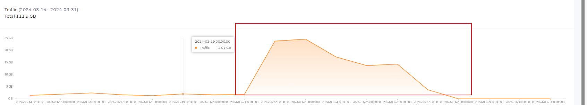

# 【数据分析】2024 年 CDN 性能优化与分发网关概况

## 2024 年 7 月 - CDN 分发网关优化

1. Cloudflare Page 和 Render 的免费静态部署有并发限制，导致加载字体时容易导致卡屏
2. 架构底层 CDN 更改为 ImageKit, 它的服务商为 AWS，没有并发限制。
3. 横向扩容 CDN 服务账号，全部 CDN 账号通过 HTTP Proxy 指向 chinese-fonts-cdn 源站。
4. 0622-0722 网关日志 135K 使用量，两个 CDN 逼近极限，扩容至 6 个。
5. 最多使用的还是那个哔咔漫画和它的多个影分身，2333。
6. 需要一个更详细的全链路监控系统。

## 2024 年 6 月 - CDN 分发网关设计

1. 由于 LightCDN 没得免费了，所以迁移 CDN
2. 中文网字计划的字体文件均为静态文件，所以可以使用前端部署的方式，将代码全量部署到各个免费的网站里面，每次构建一下然后部署，效果也不错
3. 优点是动态转发 CDN 的 host，CDN 挂了也不怕，缺点是没有 CDN 分析数据给我玩了
4. CDN 总额度高的离谱，总共 220 GB 左右，如果还能搞完，再接入一个 1T 的继续

## 2024 年 6 月已寄 LightCDN

中文网字计划使用 LightCDN 的免费服务的数据统计如下：

| Visitor Country | Total traffic | Avg latency | Avg transfer rate |
| --------------- | ------------- | ----------- | ----------------- |
| China           | 7.59 GB       | 192 ms      | 68.39 KB          |
| Hong Kong-China | 1.42 GB       | 30 ms       | 271.65 KB         |
| United States   | 1.38 GB       | 60 ms       | 289.81 KB         |
| Japan           | 850.52 MB     | 20 ms       | 436.83 KB         |
| Taiwan-China    | 487.91 MB     | 70 ms       | 211.49 KB         |

根据给出的列表格，我们可以看出该 CDN 的使用情况主要分布在东亚地区和美国。

中国大陆地区的使用量非常大，但是由于节点分布在香港和日本东京这些比较偏远的地区，对于内陆的覆盖面小，导致其平均传输量刚好和我们 cn-font-split 的默认切割大小差不多，所以效果还是勉勉强强。

在美国、新加坡和日本这些靠近边缘服务器的地区，其运输的延迟和承载能力都非常强，非常适合于字体的加载。

> 注：某些节日和特别时期期间，国外节点统统不稳定，这个是没办法的事情。

## 2024 年 3 月 部分服务挂机问题

其中一支分 CDN 在未有明确入口情况下，流量在一周内暴增，直接占满 100G 导致服务挂机。幸好是免费 CDN，没有花钱😂。

重启后发现，来自法国和日本的流量贼大，所以我们将除东京、香港和 新加坡这些环亚洲站点关闭。毕竟主要面向国内的。

| Edge locations                   | Total traffic |
|---------------------------------|---------------|
| Tokyo, Japan                    | 53.31 GB      |
| **Frankfurt, Germany**          | 46.87 GB      |
| Washington, America             | 17.59 GB      |
| Singapore                       | 11.42 GB      |
| Dubai, The United Arab Emirates | 1.62 GB       |
| Hong Kong, China                | 943.4 MB      |
| Silicon Valley, America         | 720.65 MB     |
| Sao Paulo, Brazil               | 16.7 MB       |
